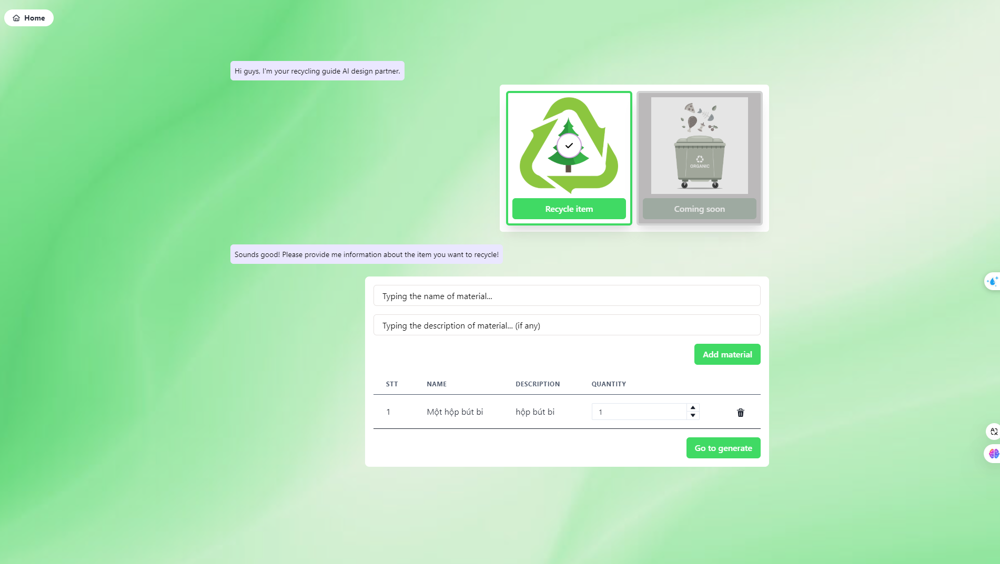
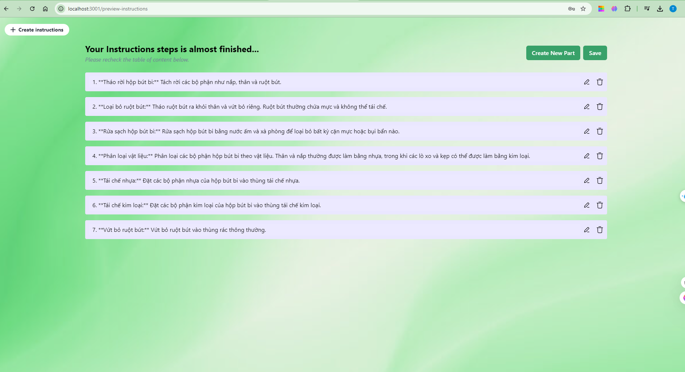
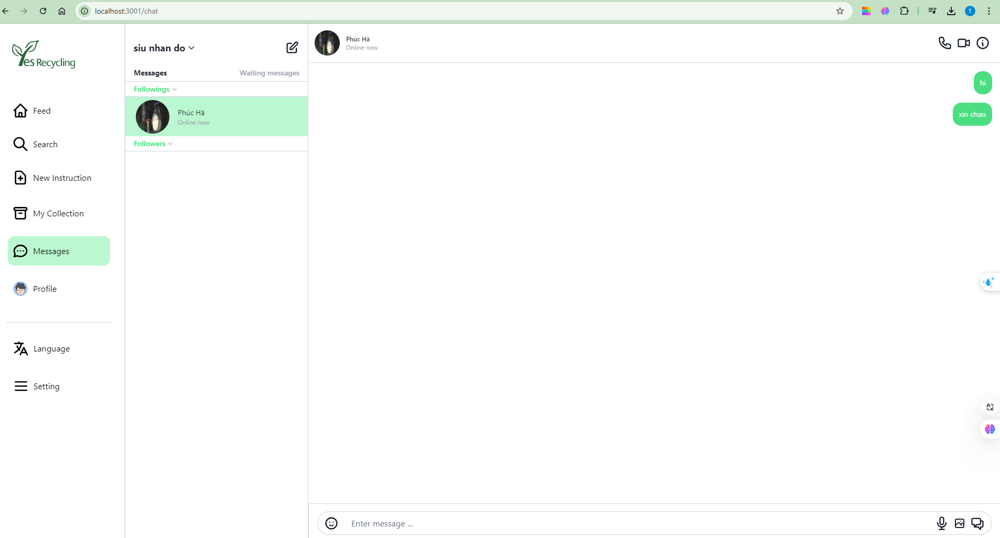
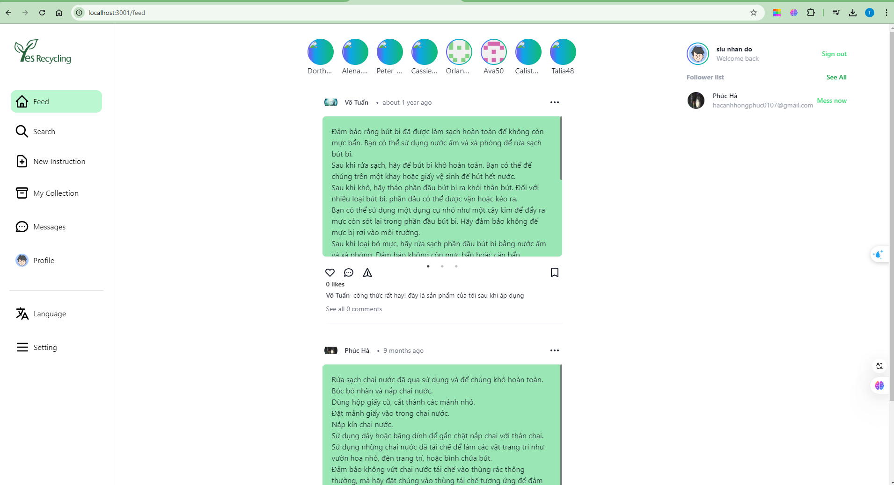
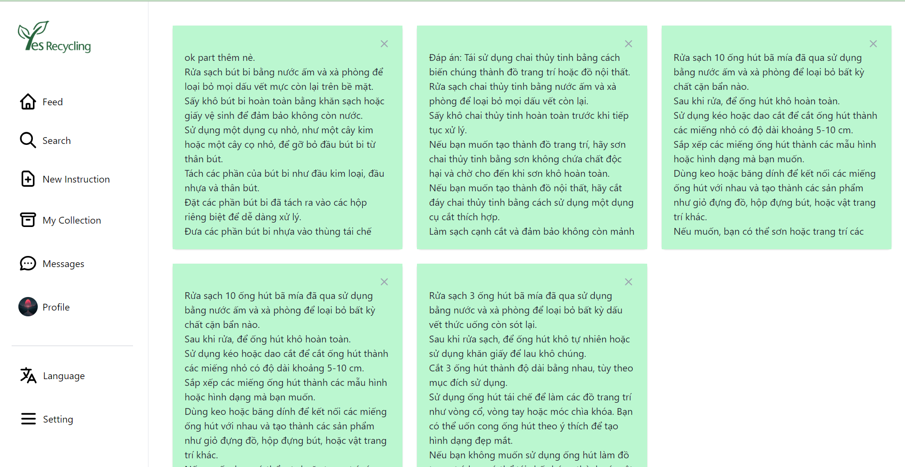
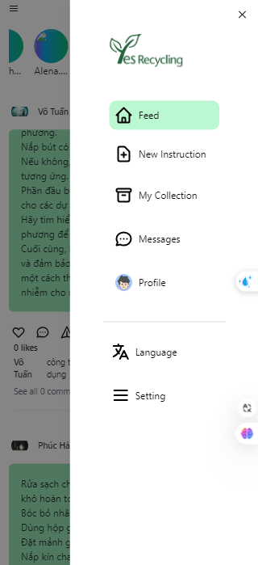

# Front-End Base

## Install & Start

⚠️ Using [Yarn Package Manager](https://yarnpkg.com/) is recommended over `npm`.

Start your app in development environment

    yarn dev

Start your app in production environment

    yarn start

## Version

1. `Node`: >=14.18.0

## Branches

1. `master`: production version
2. `develop`: development version

## Features

- **Next.js(v13.)** - Minimalistic framework for server-rendered React applications.
- **Typescript** - Superset of JavaScript which primarily provides optional static typing, classes and interfaces.
- **Zustand** - A small, fast and scalable bear bones state-management solution using simplified flux principles. Has a comfy API based on hooks, isn't boilerplate or opinionated.
- **React Query** - React Query is often described as the missing data-fetching library for React, but in more technical terms, it makes fetching, caching, synchronizing and updating server state in your React applications a breeze.
- **Chakra UI** - Chakra UI is a simple, modular and accessible component library that gives you the building blocks you need to build your React applications.

### AI-Powered Features

- **AI-Powered Recycling Assistance**:
  Provided users with suggestions on how to recycle or repurpose their items based on AI analysis using OpenAI API and good prompt engineering.

  
  

- **Real-time Communication**:
  Developed real-time chat functionalities using Socket.io to facilitate communication between users.

  

- **Community Features**:
  Developed functionality for users to share recycling tips and connect with others interested in environmental protection.

  

  **Manage your instruction**:
  This feature allows you to organize, customize, and track instructions effectively. You can modify or remove unnecessary instruction from your collection

  

- **Responsive and Interactive UI**:
  Designed a responsive and user-friendly interface using Chakra-ui and Framer Motion.

  

- **Data Fetching and Caching**:
  Implemented React Query for efficient data fetching and caching, ensuring fast and up-to-date content.

## Folder src

1. `components`: Common component to re-use and split the UI into independent, reusable pieces, and think about each piece in isolation
2. `ui-kit`: A UI kit (User Interface kit) is a pre-designed and pre-built collection of interface components, elements, and styles that help designers and developers to create consistent, user-friendly interfaces quickly and easily. (Folder name like AIButton,...)
3. `constants`: Contains constants variable example: `const NAME = 'Titus';` (Should use upper snake case)
4. `hooks`: Custom react hooks
5. `layouts`: Component that you create to provide common elements across all of your pages.
6. `pages`: Pages are associated with a route based on their file name.
7. `store`: a store is a central place where data is stored and managed for an application. It serves as a single source of truth for the application's state, and all component (We use Zustand)
8. `types`: Common typings for typescript
9. `services`: Service provides multiple functions to retrieve data from or post data to an external service using the HTTP protocol.
10. `utils`: Utility function to re-use logic

## Code convention

1. `Component` should be PascalCase
